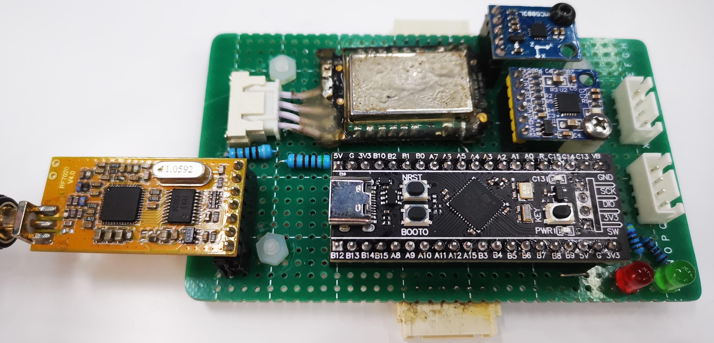

# ShelDrone-Min

 Open source stm32 Drone project with minimum fly capability. 
 
 This project uses stm32cubeIDE to build. STM32F401CCU6 is used as a default MCU.

[](implementation)

 Add the following paths to Project->Properties->C/C++ General->Paths and Symbols
 
 ```
 	Drivers/motor/Inc
 	Drivers/receiver/Inc
 	Drivers/sensor/Inc
 	Core/algorithm/Inc
 	Core/status/Inc
 ```